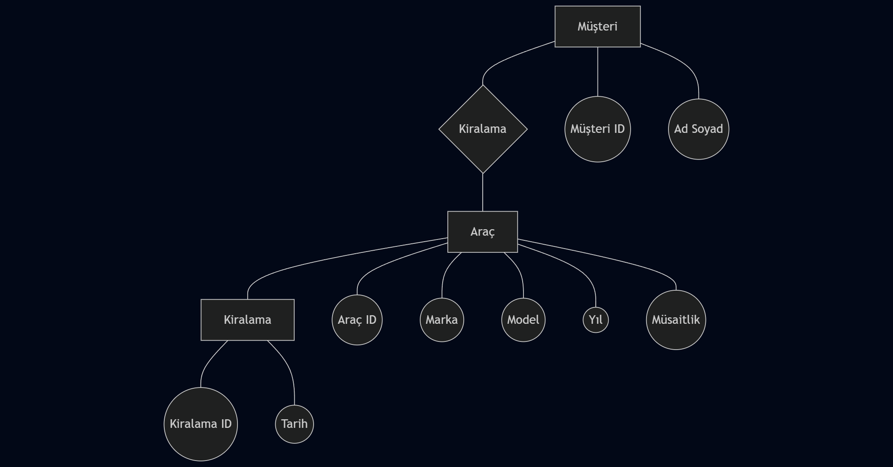

# Car Rental API

## 📝 Proje Tanımı ve Senaryo
Bu proje, bir araç kiralama şirketinin dijital yönetim süreçlerini simüle etmek amacıyla geliştirilmiştir. Sistem; araç envanterinin yönetilmesi (CRUD) ve kiralama işlemlerinin belirli iş kuralları çerçevesinde yürütülmesini sağlar.

**Senaryo:** Şirketimiz, envanterindeki araçları sadece müsaitlik durumuna göre kiralamakta ve eski model araçlar için özel bir fiyatlandırma politikası gütmektedir. Bu API, hem şirket personeli hem de müşteri uygulamaları için veri altyapısını sağlar.

Profesyonel Araç Kiralama Sistemi için geliştirilmiş RESTful API. Node.js ve Express ile MVC mimarisi kullanılarak hazırlanmıştır.

## 🛠 Kurulum
1. `npm install` komutu ile bağımlılıkları yükleyin.
2. `.env.example` dosyasını `.env` yapın.
3. `npm start` veya `node server.js` ile başlatın.

## 📌 API Uç Noktaları
- **GET /api/cars**: Tüm araçları listeler.
- **POST /api/rent/:id**: Aracı kiralar (Müsaitlik ve model yılı kontrolü yapar).

## 🧠 İş Kuralları
1. `isAvailable: false` olan araç kiralanamaz.
2. 2020 yılından eski araçlar sistem üzerinden kiralamaya kapatılmıştır.

## API Endpoint Listesi

| Method | Endpoint | Açıklama |
| :--- | :--- | :--- |
| `GET` | `/api/cars` | Tüm araçları listeler |
| `POST` | `/api/cars` | Yeni araç ekler |
| `PUT` | `/api/cars/:id` | Araç bilgilerini günceller |
| `DELETE` | `/api/cars/:id` | Aracı siler |
| `POST` | `/api/cars/:id/rent` | Aracı kiralar (isAvailable -> false) |

## İş Kuralları 

1. **Kiralama Kısıtlaması**: `rentCar` fonksiyonunda, eğer araç müsait değilse (`isAvailable: false`), kiralama işlemi reddedilir ve `400 Bad Request` döner.
2. **Fiyat Kısıtlaması**: `updateCar` fonksiyonunda, 2020 modelden eski araçların günlük fiyatı 2000 TL üzerine çıkarılamaz.

## Veritabanı İlişkileri (ER Diyagramı Açıklaması)

Bu proje in-memory veri kullanmaktadır ancak gerçek bir senaryoda ilişkisel veritabanı (SQL) için önerilen yapı şöyledir:

- **Cars (Araçlar)**
    - `id` (PK)
    - `brand`
    - `model`
    - `year`
    - `daily_price`
    - `is_available`
    
- **Customers (Müşteriler)**
    - `id` (PK)
    - `name`
    - `email`
    - `license_number`

- **Rentals (Kiralamalar)**
    - `id` (PK)
    - `car_id` (FK -> Cars.id)
    - `customer_id` (FK -> Customers.id)
    - `rent_date`
    - `return_date`
    - `total_price`

*İlişki Türü:* Bir araç birçok kez kiralanabilir (One-to-Many), bir müşteri birçok araç kiralayabilir (One-to-Many). Rentals tablosu bu ilişkiyi sağlar.

## 📊 ER Diyagramı
Projenin veritabanı tasarımına ve tablolar arası ilişkilere aşağıdaki görselden ulaşabilirsiniz:

